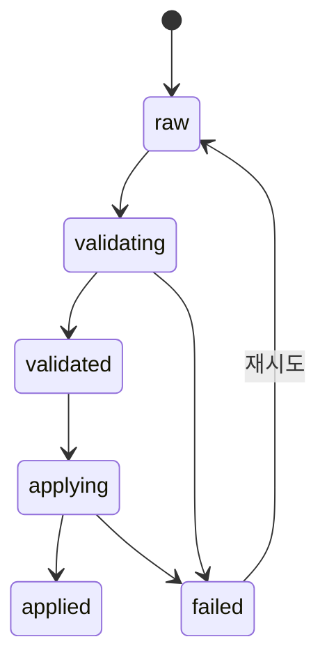

> 팀장님이 AI 코드 리뷰 시스템을 만들어주셨다. 나는 거기서 한 발 더 나아가기로 했다.

---

## 배경

우리 팀에는 PR(Pull Request, 코드 변경사항을 팀원에게 리뷰받기 위해 올리는 요청)을 올리면 AI가 자동으로 코드 리뷰 댓글을 달아주는 시스템이 있다. 팀장님이 만들어두신 것이다([Claude API로 PR 코드 리뷰 자동 검증 서버 만들기](/posts/claude-pr-review-validator/)).

리뷰 댓글이 달리면 나는 그걸 읽고, 판단하고, 코드를 고치고, 다시 커밋(변경사항 저장)해야 한다. 반복적인 패턴이다.

_이거 자동화할 수 있지 않을까?_

그래서 만들었다. **리뷰 댓글을 감지하면 → AI가 유효/무효를 검증하고 → 코드를 직접 수정해서 → commit/push까지 하는 시스템.**

결과는 리뷰 댓글에 대댓글(리뷰 댓글에 달리는 답글) 형태로 PR에 자동 등록된다.

---

## 핵심 아이디어: 리뷰 이슈를 A/B/C로 분류한다

리뷰 댓글에는 성격이 다른 이슈들이 섞여있다.

| 분류 | 의미 | 처리 방법 |
|------|------|-----------|
| **A. 바로 수정 가능** | before/after가 명확한 이슈 | 자동으로 코드 수정 |
| **B. 인간이 결정해야 할 일** | 트레이드오프/비즈니스 판단 필요 | 웹 UI에서 결정 입력 후 수정 |
| **C. 수정 불필요** | 무효 판정 | 건너뜀 |

A는 Claude가 알아서 고친다. C는 건드리지 않는다. B만 사람이 개입한다.

완전 자동화는 어렵다. 하지만 **사람이 개입해야 할 범위를 최소화**하는 것이 목표다.

---

## 전체 흐름

```
[Bitbucket] 리뷰어가 PR에 리뷰 댓글 작성
    ↓
[poller] Bitbucket API 폴링 → 새 리뷰 감지 → DB 저장
    ↓  대댓글 없는 댓글만 처리 (대댓글 있으면 처리완료로 간주)
[validator] Claude CLI로 A/B/C 분류 → DB 저장
    ↓
[web] http://localhost:8000 에서 분류 결과 확인
    ↓  B항목 결정 입력 후 Apply 버튼 클릭
[applier] repo clone/fetch → 이슈별로 Claude CLI 실행 → 코드 수정
    ↓
[applier] 빌드 → commit → push
    ↓
[applier] Claude CLI로 수정 검증 → Bitbucket 대댓글 등록 (SUCCESS / FAIL)
```

전체 파이프라인이 돌아가면 Bitbucket PR에 아래와 같은 대댓글이 자동으로 달린다.

```
| 이슈 | 카테고리 | 결정 | 액션 |
|------|----------|------|------|
| 이슈 1 — 변수명 개선 | A | — | 수정 완료 |
| 이슈 2 — 예외 처리 방식 | B | 대안 A | 수정 완료 |
| 이슈 3 — 불필요한 주석 | C | — | 변경 없음 |

**Commit**: `a1b2c3d`
**수정 파일**: `src/Service.java`

**SUCCESS**
```

---

## 컨테이너 구조

4개의 Docker 컨테이너로 역할을 분리했다.


각 컨테이너가 맡은 일을 구체적으로 정리하면 다음과 같다.

---

### poller — 리뷰 감지기

Bitbucket API를 60초마다 폴링(주기적으로 API를 호출해 변경사항을 확인하는 것)해서 새로운 PR 리뷰 댓글을 감지한다.

- 이미 처리된 리뷰(= 대댓글이 달린 댓글)는 건너뛴다. 대댓글이 있다는 것은 이미 처리가 완료됐다는 신호다.
- 처리 대상인 리뷰만 골라 DB에 수신 대기(`raw`) 상태로 저장한다.

> "리뷰 댓글 중 아직 처리 안 된 것만 뽑아서 대기열에 넣는 역할"

---

### validator — 리뷰 분류기

DB에 쌓인 수신 대기(`raw`) 리뷰를 꺼내 Claude CLI로 분석한다.

- 각 리뷰 이슈를 **A / B / C** 세 가지로 분류한다.
  - **A**: 수정 방향이 명확해서 바로 자동 수정 가능
  - **B**: 트레이드오프나 비즈니스 판단이 필요해서 사람이 결정해야 함
  - **C**: 무효 판정 — 수정하지 않아도 되는 항목
- 분류 결과를 DB에 분류 완료(`validated`) 상태로 저장한다.

> "AI가 리뷰를 읽고 '바로 고칠 것 / 사람이 판단할 것 / 무시할 것'으로 나누는 역할"

---

### web — 결정 UI

분류 결과를 사람이 볼 수 있는 화면으로 제공한다.

- B항목(사람이 결정해야 할 이슈)을 목록으로 보여주고 결정을 입력받는다.
- Apply 버튼을 누르면 B항목에 대한 결정과 함께 코드 수정 요청을 applier에 전달한다.

> "사람이 개입해야 할 부분만 추려서 결정을 받고, 코드 수정을 트리거하는 역할"

---

### applier — 코드 수정 · 검증 · 보고

파이프라인의 마지막 단계를 모두 담당한다.

**기동 시 준비:**
- `REPO_SLUGS`(관리할 저장소 목록을 담은 환경변수)에 정의된 저장소가 로컬에 없으면 clone한다.
- 이미 있으면 최신 상태로 fetch한다.

**코드 수정:**
- A항목은 이슈별로 Claude CLI를 따로 실행해서 자동 수정한다.
- B항목은 사람이 내린 결정을 프롬프트에 담아 Claude CLI로 수정한다.
- C항목은 건드리지 않는다.
- 수정이 끝나면 빌드 → commit → push한다.

**수정 검증:**
- commit 직후 변경된 diff를 Claude CLI에 넘겨서 "의도한 수정이 모두 반영됐는지" 확인한다.
- 누락된 항목이 있으면 **FAIL**, 없으면 **SUCCESS**로 판정한다.

**결과 보고:**
- 검증 결과를 표 형태로 Bitbucket PR에 대댓글로 등록한다.

> "코드를 실제로 고치고 → 맞게 고쳤는지 확인하고 → 결과를 PR에 남기는 역할"

---

| 컨테이너 | 역할 |
|----------|------|
| **poller** | Bitbucket API 폴링. 대댓글 없는 리뷰 댓글만 감지해서 DB 저장 |
| **validator** | DB에서 수신 대기 리뷰를 꺼내 Claude CLI로 A/B/C 분류 후 저장 |
| **web** | 분류 결과 조회 UI. B항목 결정 입력 + Apply 버튼 |
| **applier** | 저장소 준비 → 코드 수정 → 빌드 → commit/push → 검증 → 대댓글 등록 |

SQLite 하나를 4개 컨테이너가 공유한다. 상태 흐름은 이렇다.



| 상태 | 의미 |
|------|------|
| `raw` | poller가 감지해서 저장한 수신 대기 상태 |
| `validating` | validator가 분류 중인 상태 |
| `validated` | A/B/C 분류가 완료된 상태 |
| `applying` | applier가 코드 수정 중인 상태 |
| `applied` | 코드 수정·검증·대댓글 등록까지 완료된 상태 |
| `failed` | 처리 중 오류가 발생한 상태 |

---

## 재시도와 후처리

### 재시도 시나리오

`failed` 상태가 되는 경우는 두 가지다.

**validator 실패**
- Claude CLI 호출 자체가 실패한 경우 (네트워크 오류, 프로세스 타임아웃 등)
- 응답이 왔지만 파싱할 수 없는 형식인 경우

**applier 실패**
- 빌드가 실패한 경우
- commit 또는 push가 실패한 경우 (충돌, 권한 문제 등)

`failed` 상태인 항목은 주기적으로 수신 대기(`raw`) 상태로 되돌려 재시도 대기열에 넣는다. validator와 applier는 각자 자신이 처리해야 할 상태를 폴링하므로 별도의 재시도 트리거 없이 자연스럽게 다시 처리된다.

---

### 후처리 시나리오

applier가 대댓글을 등록하고 나면 두 가지 결과 중 하나다.

**SUCCESS인 경우**
- 모든 이슈가 의도대로 수정됐다.
- 대댓글이 달렸으므로 poller는 이 댓글을 "이미 처리 완료"로 간주하고 다음 폴링부터 건너뛴다.
- 파이프라인 종료.

**FAIL인 경우**
- 누락된 항목이 있거나, 의도와 다르게 수정됐다는 뜻이다.
- 대댓글에 FAIL과 함께 어떤 항목이 문제인지 기록된다.
- 대댓글이 달렸으므로 poller는 이 댓글을 건너뛴다. **자동 재시도는 하지 않는다.**
- 사람이 FAIL 내용을 확인하고 직접 수정하거나, 대댓글을 지워서 파이프라인을 다시 태운다.

FAIL을 자동 재시도하지 않는 이유는 명확하다. "의도대로 수정되지 않았다"는 판정이 나왔는데 같은 프롬프트로 다시 시도하면 같은 결과가 나올 가능성이 높다. 이 시점에서는 사람이 개입해서 원인을 파악하는 게 낫다.

---

## Claude를 어떻게 코드 수정에 썼나

`claude --dangerously-skip-permissions -p -` 옵션으로 프롬프트를 표준 입력(stdin, 키보드 대신 프로그램이 텍스트를 직접 주입하는 방식)으로 전달해서 실행한다. `-p`는 프롬프트 모드(대화형 세션 없이 한 번 실행하고 종료), 마지막 `-`는 프롬프트를 stdin에서 읽겠다는 표시다.

```python
result = subprocess.run(
    ["claude", "--dangerously-skip-permissions", "-p", "-"],
    input=prompt,
    cwd=repo_dir,  # 저장소 디렉토리에서 실행
    capture_output=True,
    text=True,
    env=claude_env,
)
```

`cwd=repo_dir`로 실행하면 Claude가 해당 저장소의 파일을 직접 읽고 수정한다. API Key 없이 Claude Pro 구독의 로컬 인증 정보(`~/.claude.json`)를 사용한다.

> **`--dangerously-skip-permissions`에 대해**: 이 플래그는 Claude CLI가 파일 시스템에 접근할 때 사용자 확인 프롬프트를 건너뛴다. 비대화형 환경(Docker 컨테이너, CI)에서 자동화를 위해 필요하지만, **지정된 저장소 디렉토리(`cwd`)를 벗어난 파일에도 접근할 수 있다**. 컨테이너 안에서만 실행하고 외부 볼륨 마운트 범위를 최소화하는 것이 안전하다.

이슈 하나당 `claude -p` 한 번씩 실행한다. 한 번에 몰아서 실행하면 서로 간섭이 생기기 때문이다.

```python
# A항목: 이슈별 개별 실행
for item in a_items:
    prompt = f"다음 코드 수정사항을 적용해주세요. 해당 항목만 수정하고 다른 코드는 건드리지 마세요.\n\n{item['body']}"
    _run_claude_subtask(repo_dir, f"A: {item['title']}", prompt, claude_env)

# B항목: 사람이 결정한 내용을 반영
for title, decision in decisions.items():
    prompt = f"다음 이슈에 대한 결정 사항을 코드에 반영해주세요.\n\n결정: {decision}"
    _run_claude_subtask(repo_dir, f"B: {title}", prompt, claude_env)
```

commit & push 후에는 Claude가 한 번 더 실행된다. `git show HEAD`로 방금 커밋된 변경 diff(커밋 전후 코드 차이)를 추출해서 "이 변경사항이 의도한 수정사항을 모두 반영했는지 확인해줘"라고 넘긴다.

```python
git_diff = _git(["show", "HEAD"], cwd=repo_dir)
verify_result = _run_claude_verify(repo_dir, validation_content, decisions, git_diff, claude_env)
```

결과는 JSON으로 받아 대댓글 표로 변환한다. 누락 항목이 있으면 `FAIL`, 없으면 `SUCCESS`가 붙는다.

---

## 설계 결정들

**왜 파일 저장 대신 SQLite를 썼나?**
4개 컨테이너가 상태를 공유해야 했다. 볼륨 마운트된 SQLite 하나가 가장 단순했다. 단, SQLite는 동시 쓰기에 제약이 있다. 여러 컨테이너가 동시에 쓰려고 하면 잠금(lock) 경합이 생긴다. 이 시스템은 poller·validator·applier가 각자 다른 상태(`raw` → `validating` → `applying`)에 쓰기 때문에 실질적인 경합이 드물었고, WAL(Write-Ahead Logging) 모드를 켜서 읽기/쓰기 충돌을 추가로 완화했다. 처리량이 많아지면 PostgreSQL 같은 서버형 DB로 교체하는 것이 자연스러운 다음 단계다.

**왜 webhook 대신 polling을 썼나?**
Bitbucket Cloud의 PR 코멘트 webhook은 이벤트 페이로드에 기존 댓글 목록이 포함되지 않는다. "대댓글이 이미 달린 댓글인지" 판별하려면 어차피 API를 다시 호출해야 한다. polling으로 설계하면 처리 누락 시 다음 주기에 자연히 재시도되고, 컨테이너 재시작 후에도 DB 상태만 있으면 이어서 처리할 수 있다. 지연이 60초 이내라면 팀 단위 사용에서 체감 차이가 없다고 판단했다.

**왜 대댓글이 달린 리뷰는 건너뛰나?**
대댓글 = 이미 처리된 리뷰라고 간주한다. poller가 폴링할 때 이미 답장이 달린 댓글 목록을 먼저 수집하고, 해당 댓글들은 DB에 넣지 않는다.

**B항목을 왜 사람이 결정하나?**
트레이드오프가 있는 이슈는 Claude도 맥락을 모른다. 성능 vs 안정성, 기존 API 호환성 유지 여부 같은 것들은 팀의 판단이 필요하다. 이런 항목만 웹 UI에 노출해서 결정을 받는다.

---

## 운영 환경 제약사항

이 시스템을 실제로 돌리려면 몇 가지 전제가 필요하다.

**Claude Pro 구독 (API Key 불가)**
Claude CLI는 Anthropic API Key가 아닌 Claude Pro 구독의 로컬 인증 정보(`~/.claude.json`)를 사용한다. API Key 방식을 쓰려면 별도 설정이 필요하다. 컨테이너 실행 전에 호스트 머신에서 `claude` 로그인을 완료하고, `~/.claude.json`을 컨테이너 볼륨으로 마운트해야 한다.

```yaml
# docker-compose.yml 예시
volumes:
  - ~/.claude.json:/root/.claude.json:ro
```

**Claude CLI가 컨테이너 안에 설치되어 있어야 한다**
applier·validator 이미지 빌드 시 Node.js와 Claude CLI를 함께 설치해야 한다.

```dockerfile
RUN apt-get install -y nodejs npm && npm install -g @anthropic-ai/claude-code
```

**저장소 접근 권한**
applier가 `git clone` / `push`를 하려면 Bitbucket 자격증명(SSH 키 또는 앱 패스워드)이 컨테이너에 마운트되어 있어야 한다. SSH 키를 사용한다면 `~/.ssh`를 마운트하거나 컨테이너 환경변수로 주입한다.

**단일 머신 가정**
SQLite 볼륨 마운트 구조상 모든 컨테이너가 같은 호스트에서 실행되어야 한다. 멀티 노드 환경으로 확장하려면 서버형 DB와 메시지 큐로 교체가 필요하다.

---

## 기술 스택

| 항목 | 선택 |
|------|------|
| 언어 | Python 3.12 |
| 웹 프레임워크 | FastAPI 0.115 (Python 비동기 웹 프레임워크) |
| AI | Claude CLI `@anthropic-ai/claude-code` (npm) |
| Bitbucket API | REST v2.0 / httpx 0.27 (Python HTTP 클라이언트) |
| DB | SQLite / aiosqlite 0.20 (비동기 SQLite 드라이버) |
| 배포 | Docker, docker-compose |

---

## 소스코드

[https://github.com/toothless486/webhook-server](https://github.com/toothless486/webhook-server)

---

## 마치며

완전 자동화는 아니다. B항목은 여전히 사람이 결정해야 한다. 하지만 리뷰 댓글을 읽고 → 유효한지 판단하고 → 코드를 수정하고 → 빌드를 확인하고 → commit/push하는 반복 작업은 없어졌다.

팀장님이 리뷰 시스템을 만들어주셨으니, 나는 그 리뷰를 처리하는 시스템을 만들었다. 이제 PR을 올리고 나면 할 일이 많이 줄었다.
