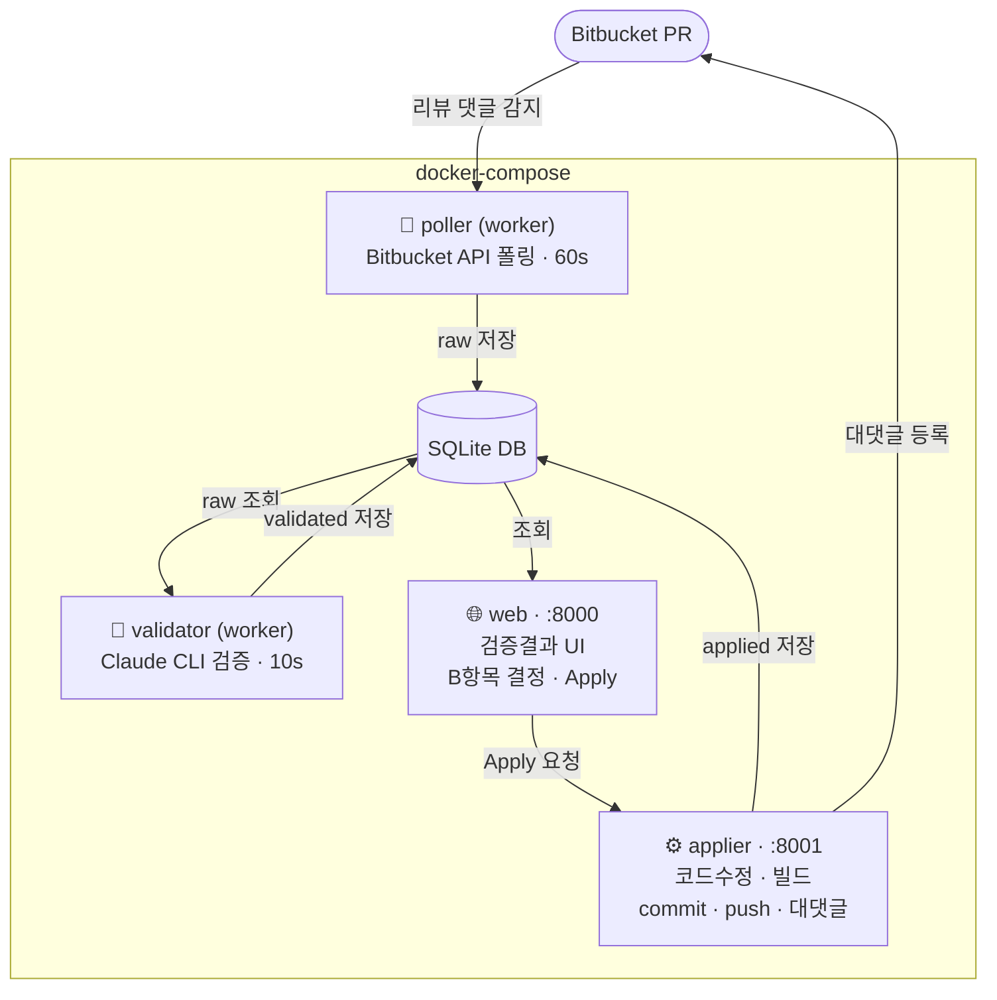
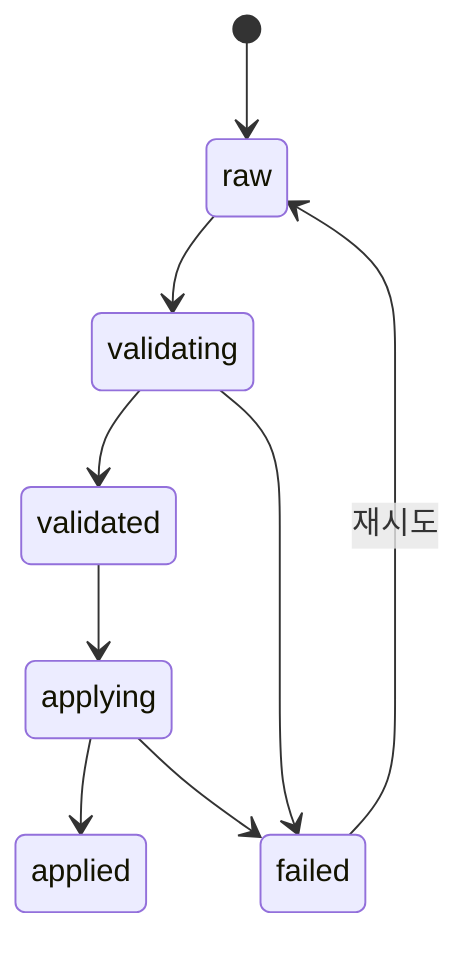

> 팀장님이 AI 코드 리뷰 시스템을 만들어주셨다. 나는 거기서 한 발 더 나아가기로 했다.

---

## 배경

우리 팀에는 PR을 올리면 AI가 자동으로 코드 리뷰 댓글을 달아주는 시스템이 있다. 팀장님이 만들어두신 것이다.

리뷰 댓글이 달리면 나는 그걸 읽고, 판단하고, 코드를 고치고, 다시 커밋해야 한다. 반복적인 패턴이다.

_이거 자동화할 수 있지 않을까?_

그래서 만들었다. **리뷰 댓글을 감지하면 → AI가 유효/무효를 검증하고 → 코드를 직접 수정해서 → commit/push까지 하는 시스템.**

---

## 전체 흐름

```
[Bitbucket] 리뷰어가 PR에 리뷰 댓글 작성
    ↓
[poller] Bitbucket API 폴링 → 새 리뷰 감지 → DB 저장
    ↓  대댓글 없는 댓글만 처리 (대댓글 있으면 처리완료로 간주)
[validator] Claude CLI로 A/B/C 분류 검증 → DB 저장
    ↓
[web] http://localhost:8000 에서 검증 결과 확인
    ↓  B항목 결정 입력 후 Apply 버튼 클릭
[applier] repo clone/fetch → 이슈별 subtask 분할 → claude -p 로 코드 수정
    ↓
[applier] 빌드 → commit → push
    ↓
[applier] Claude CLI로 수정 검증 → Bitbucket 대댓글 등록 (SUCCESS / FAIL)
```

전체 파이프라인이 돌아가면 Bitbucket PR에 아래와 같은 대댓글이 자동으로 달린다.

```
| 이슈 | 카테고리 | 결정 | 액션 |
|------|----------|------|------|
| 이슈 1 — 변수명 개선 | A | — | 수정 완료 |
| 이슈 2 — 예외 처리 방식 | B | 대안 A | 수정 완료 |
| 이슈 3 — 불필요한 주석 | C | — | 변경 없음 |

**Commit**: `a1b2c3d`
**수정 파일**: `src/Service.java`

**SUCCESS**
```

---

## 핵심 아이디어: 리뷰 이슈를 A/B/C로 분류한다

리뷰 댓글에는 성격이 다른 이슈들이 섞여있다.

| 분류 | 의미 | 처리 방법 |
|------|------|-----------|
| **A. 바로 수정 가능** | before/after가 명확한 이슈 | Apply 시 자동 처리 |
| **B. 인간이 결정해야 할 일** | 트레이드오프/비즈니스 판단 필요 | 웹 UI에서 결정 입력 후 Apply |
| **C. 수정 불필요** | 무효 판정 | 건너뜀 |

A는 Claude가 알아서 고친다. C는 건드리지 않는다. B만 사람이 개입한다.

완전 자동화는 어렵다. 하지만 **사람이 개입해야 할 범위를 최소화**하는 것이 목표다.

---

## 컨테이너 구조

4개의 컨테이너로 역할을 분리했다.



| 컨테이너 | 역할 |
|----------|------|
| **poller** | Bitbucket API 폴링. 대댓글 없는 리뷰 댓글만 감지해서 DB 저장 |
| **validator** | DB에서 `raw` 리뷰를 꺼내 Claude CLI로 A/B/C 분류 후 저장 |
| **web** | 검증 결과 조회 UI. B항목 결정 입력 + Apply 버튼 |
| **applier** | 코드 수정 → 빌드 → commit/push → 검증 → 대댓글 등록 |

SQLite 하나를 4개 컨테이너가 공유한다. 상태 흐름은 이렇다.



---

## Claude를 어떻게 코드 수정에 썼나

`claude --dangerously-skip-permissions -p -` 옵션으로 프롬프트를 stdin으로 전달해서 실행한다.

```python
result = subprocess.run(
    ["claude", "--dangerously-skip-permissions", "-p", "-"],
    input=prompt,
    cwd=repo_dir,  # 저장소 디렉토리에서 실행
    capture_output=True,
    text=True,
    env=claude_env,
)
```

`cwd=repo_dir`로 실행하면 Claude가 해당 저장소의 파일을 직접 읽고 수정한다. API Key 없이 Pro 세션(`~/.claude.json`)을 사용한다.

이슈 하나당 `claude -p` 한 번씩 실행한다. 한 번에 몰아서 실행하면 서로 간섭이 생기기 때문이다.

```python
# A항목: 이슈별 개별 실행
for item in a_items:
    prompt = f"다음 코드 수정사항을 적용해주세요. 해당 항목만 수정하고 다른 코드는 건드리지 마세요.\n\n{item['body']}"
    _run_claude_subtask(repo_dir, f"A: {item['title']}", prompt, claude_env)

# B항목: 사람이 결정한 내용을 반영
for title, decision in decisions.items():
    prompt = f"다음 이슈에 대한 결정 사항을 코드에 반영해주세요.\n\n결정: {decision}"
    _run_claude_subtask(repo_dir, f"B: {title}", prompt, claude_env)
```

---

## 수정 후 검증도 Claude가 한다

commit & push 후에 Claude가 한 번 더 실행된다. `git show HEAD` diff를 넘겨서 "이 변경사항이 의도한 수정사항을 모두 반영했는지 확인해줘"라고 물어본다.

```python
git_diff = _git(["show", "HEAD"], cwd=repo_dir)
verify_result = _run_claude_verify(repo_dir, validation_content, decisions, git_diff, claude_env)
```

결과는 JSON으로 받아 대댓글 표로 변환한다. 누락 항목이 있으면 `FAIL`, 없으면 `SUCCESS`가 붙는다.

---

## 설계 결정들

**왜 파일 저장 대신 SQLite를 썼나?**
4개 컨테이너가 상태를 공유해야 했다. 볼륨 마운트된 SQLite 하나가 가장 단순했다.

**왜 대댓글이 달린 리뷰는 건너뛰나?**
대댓글 = 이미 처리된 리뷰라고 간주한다. poller가 폴링할 때 `replied_ids`를 먼저 수집하고 이미 답장된 댓글은 DB에 넣지 않는다.

**B항목을 왜 사람이 결정하나?**
트레이드오프가 있는 이슈는 Claude도 맥락을 모른다. 성능 vs 안정성, 기존 API 호환성 유지 여부 같은 것들은 팀의 판단이 필요하다. 이런 항목만 웹 UI에 노출해서 결정을 받는다.

---

## 기술 스택

| 항목 | 선택 |
|------|------|
| 언어 | Python 3.12 |
| 웹 프레임워크 | FastAPI |
| AI | Claude CLI (`@anthropic-ai/claude-code`) |
| Bitbucket API | REST v2.0 (httpx) |
| DB | SQLite (aiosqlite) |
| 배포 | Docker, docker-compose |

---

## 소스코드

[https://github.com/toothless486/webhook-server](https://github.com/toothless486/webhook-server)

---

## 마치며

완전 자동화는 아니다. B항목은 여전히 사람이 결정해야 한다. 하지만 리뷰 댓글을 읽고 → 유효한지 판단하고 → 코드를 수정하고 → 빌드를 확인하고 → commit/push하는 반복 작업은 없어졌다.

팀장님이 리뷰 시스템을 만들어주셨으니, 나는 그 리뷰를 처리하는 시스템을 만들었다. 이제 PR을 올리고 나면 할 일이 많이 줄었다.
