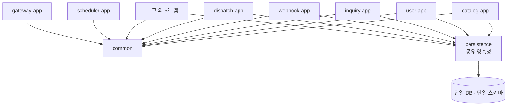
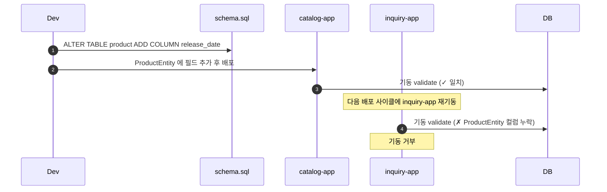
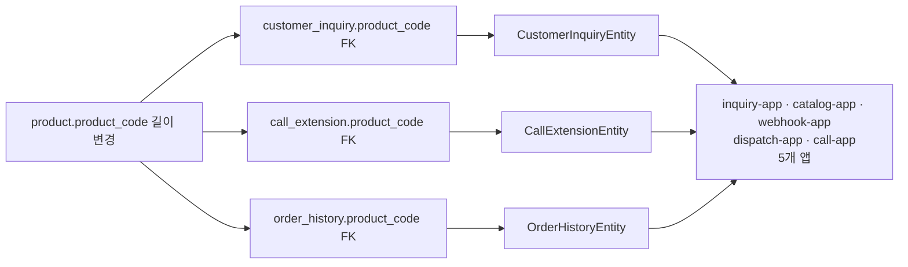
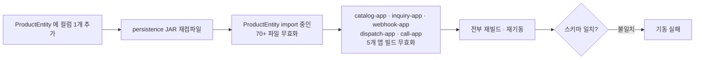
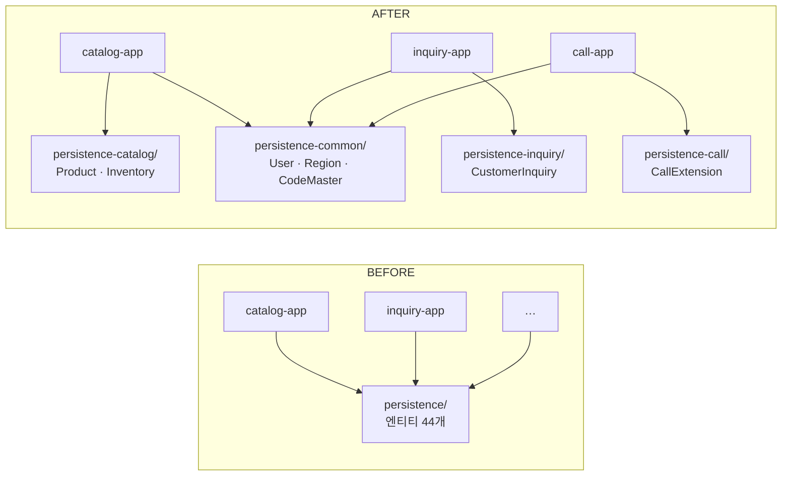
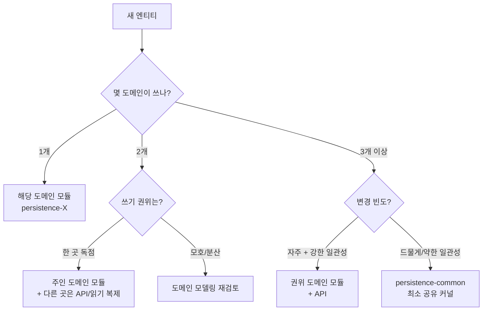
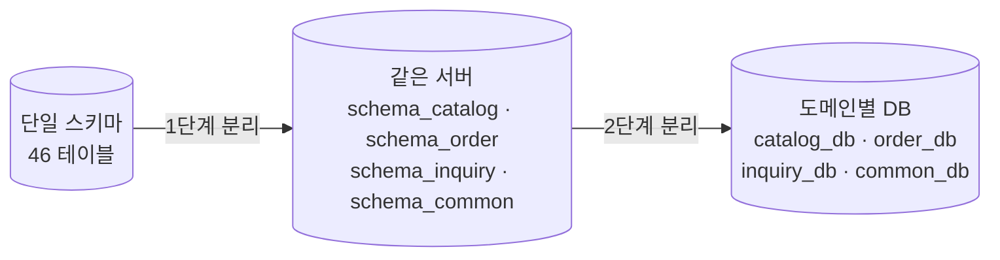
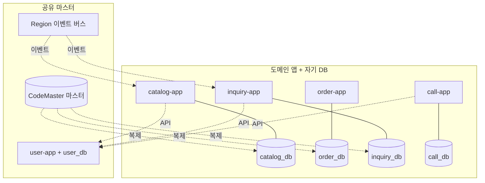
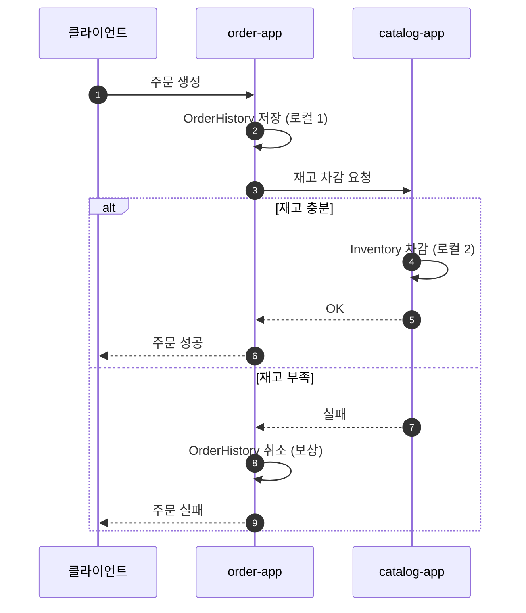

> 마이크로서비스로 분리해 배포하고 있는데, 컬럼 하나만 바꿔도 모든 서비스가 다시 빌드되고 재기동된다.

이 글은 그런 백엔드 사례를 풀어본다. 표면적으로는 마이크로서비스인데, 속을 들여다보면 두 개의 결합이 동시에 작동하고 있어서 *"정말 마이크로서비스가 맞는가?"*라는 질문이 자연스러워진다.

여기서 보려는 두 결합은 성격이 다르다.

- **데이터·스키마 결합** — 모든 서비스가 데이터베이스를 공유한다.
- **소스·빌드 결합** — 모든 서비스가 같은 영속성 모듈에 컴파일 단계에서 의존한다.

이 둘은 종종 한 묶음으로 다뤄지지만, 사실 **별개의 문제이고 별개의 해법**이 필요하다.

> **TL;DR**
> - "한 번의 DB 변경 = 전 서비스 재빌드"의 진짜 원인은 두 개다.
> - DB만 분리해도 빌드 결합은 풀리지 않고, 모듈만 분리해도 데이터 결합은 풀리지 않는다.
> - 둘 다 풀려면 **소스 구조 분리**와 **스키마 분리**를 같이 해야 하며, 분리하는 순간 **분산 시스템의 새 비용**이 생긴다. 그래서 점진적으로 간다.

---

## 프로젝트 개요와 현재 구조

### 디렉터리/모듈 트리

이 사례 백엔드는 Gradle 멀티 모듈로 약 서른 개 모듈을 갖는다. 익명화한 골격은 다음과 같다.

```
project-root/
├── apps/                              ← 배포 단위 (Spring Boot 앱, 총 10개)
│   ├── catalog-app/                   ← 상품 카탈로그 (도메인 코어)
│   ├── user-app/                      ← 사용자 계정
│   ├── inquiry-app/                   ← 고객 문의 백오피스
│   ├── webhook-app/                   ← 외부 시스템 webhook 수신 → publish
│   ├── dispatch-app/                  ← 메시지 큐 소비 + 실시간 push
│   └── …                              ← 그 외 store-kiosk-app · call-app · admin-app · auth-app · identity-verify-app
├── common/                            ← 공통 유틸·AOP·예외 (모든 앱이 의존)
├── persistence/                       ← 공유 JPA 엔티티 + Repository (모든 앱이 의존)
├── infrastructure/                    ← 외부 시스템 어댑터 (×16)
│   ├── object-storage/
│   ├── pg/                            ← 결제 게이트웨이
│   ├── sso/                           ← SSO 연동
│   └── …
├── gateway/                           ← API Gateway (Spring Cloud Gateway)
├── scheduler/                         ← 배치/스케줄
├── db/
│   └── schema/
│       └── schema.sql                 ← 단일 스키마 파일 (46 테이블 · 3,793줄)
└── docker/
    └── local/compose.yaml             ← 단일 MySQL 컨테이너
```

트리에서 강하게 부각되는 두 점이 있다.

- `persistence/`가 한 곳에만 있다. 즉 모든 서비스가 같은 영속성 모듈을 본다.
- `db/schema/schema.sql`도 하나다. 즉 모든 서비스가 같은 스키마를 본다.

이 두 점이 뒤에 볼 두 결합의 근원이다.

### 모듈 구성 요약

| 구분 | 모듈/지표 | 개수 |
|------|------|------|
| 배포 단위 | 서비스 앱 (Spring Boot) | 10 |
| 배포 단위 | 게이트웨이 / 스케줄러 | 2 |
| 공유 라이브러리 | 공통 모듈 (`common`) | 1 |
| 공유 라이브러리 | 공유 영속성 모듈 (`persistence`) | 1 |
| 외부 연동 | 인프라 어댑터 (`infrastructure/*`) | 16 |
| 영속성 내부 | JPA 엔티티 클래스 | **44** |
| 영속성 내부 | Spring Data JpaRepository | **42** |
| 영속성 내부 | QueryDSL 커스텀 Repository | **27** |
| 스키마 | `db/schema/schema.sql` (단일 파일) | **46 테이블 · 3,793줄** |
| **합계** | | **~30 모듈** |

서비스 앱은 도메인 기능별로 잘 쪼개져 있다. 문제는 모든 앱이 같은 영속성 모듈과 같은 DB를 향하고 있다는 점이다.

### 영속성 모듈을 열어보기

"공유 영속성 모듈"이라는 한 단어 뒤에 실제로 무엇이 들어있는지 보자.

```
persistence/src/main/java/.../persistence/
├── jpa/
│   ├── entity/                  ← 엔티티 44개가 한 디렉터리에 평면적으로
│   │   ├── UserEntity.java
│   │   ├── ProductEntity.java
│   │   ├── ProductDetailEntity.java
│   │   ├── OrderHistoryEntity.java
│   │   ├── InventoryHistoryEntity.java
│   │   ├── CustomerInquiryEntity.java
│   │   ├── CallExtensionEntity.java
│   │   ├── CodeMasterEntity.java
│   │   ├── RegionEntity.java
│   │   ├── MenuItemEntity.java
│   │   ├── NoticeEntity.java
│   │   ├── RefreshTokenEntity.java
│   │   └── …  (총 44개, 도메인 패키지 없음)
│   └── repository/              ← JpaRepository 인터페이스 42개도 같은 방식
└── qdsl/                        ← QueryDSL 커스텀 Repository 27개
```

핵심은 **`entity/` 한 디렉터리에 엔티티 44개가 평면적으로** 있다는 점이다. 도메인별 패키지(예: `entity/order/`, `entity/inquiry/`, `entity/catalog/`)가 없다. 사용자 엔티티 옆에 상품 엔티티가 있고, 그 옆에 통신 내선 엔티티가 있다.

이 평면 배치 자체가 결합의 시각적 신호다. **어느 도메인의 엔티티가 바뀌든 같은 JAR이 통째로 다시 컴파일된다.**

### 스키마 파일을 열어보기

스키마도 비슷한 형태다. `db/schema/schema.sql` **한 파일**에 46개 테이블이 다 들어있다. 별도의 마이그레이션 도구(Flyway·Liquibase)는 없고, 변경은 SQL 파일에 사람이 추가하는 식이다.

테이블 이름을 일부만 뽑아보면 한 파일에 얼마나 많은 도메인이 섞여 있는지 보인다.

```
user, user_group, user_group_permission, menu_item, menu_favorite,
product, product_detail, order_history, inventory_history,
customer_inquiry, customer_inquiry_daily_trend, customer_inquiry_ranking_snapshot,
call_extension, dispatch_request, message_send_history, notification_preference,
code_master, code_master_group, region,
access_token_whitelist, refresh_token, auth_change_history,
notice, recipient_info, report_send_history, report_send_line,
…  (총 46개)
```

사용자·상품·주문/재고·고객 문의·통신·인증·알림 도메인이 한 파일 안에 다 들어있다. **변경 한 줄이 어디까지 영향을 줄지 정적으로 추적할 단서가 파일 구조에 없다.**

### 서비스가 영속성 모듈을 어떻게 의존하나

서비스 앱들의 `build.gradle`을 펼쳐보면 패턴이 똑같다.

```gradle
// apps/catalog-app/build.gradle
dependencies {
    implementation project(':common')
    implementation project(':persistence')   // ← 공유 영속성
    implementation project(':infrastructure:object-storage')
    implementation project(':infrastructure:pg')
}
```

```gradle
// apps/user-app/build.gradle
dependencies {
    implementation project(':common')
    implementation project(':persistence')   // ← 동일
    implementation project(':infrastructure:sso')
}
```

도메인이 다른 앱(`inquiry-app`, `dispatch-app`, `call-app`, …)을 열어봐도 `:persistence` 한 줄은 그대로 있다. **열 개 앱 모두**가 이 한 줄을 갖고 있다. 어떤 서비스든 자기 도메인이 쓰지 않는 엔티티까지 같은 JAR로 함께 끌려 들어온다.

### 서비스 의존 구조

의존 관계를 그림으로 보면 더 분명하다.



열 개 서비스의 의존선이 한 점으로 수렴한다. **데이터 접근 코드가 한 곳에 모여 있고, 모든 서비스가 그 한 점을 바라본다.** 이게 결합의 시각적 근거다.

### 한 엔티티가 얼마나 넓게 퍼져있나

정량 증거로 보면 더 분명하다. 공유 영속성 모듈의 핵심 엔티티 몇 개가 서비스 앱 코드에서 얼마나 import 되는지 세어보면:

| 엔티티 | import 하는 소스 파일 수 | 사용하는 서비스 앱 |
|---|---|---|
| `UserEntity` | **27** | user-app · admin-app · webhook-app · inquiry-app · call-app |
| `ProductEntity` | **70+** | catalog-app · inquiry-app · webhook-app · dispatch-app · call-app |
| `CodeMasterEntity` | (광역) | 거의 모든 앱 |

`ProductEntity`에 컬럼 하나를 추가하면 그 엔티티를 import 하는 70여 개 파일의 컴파일 단위가 무효화된다. 그리고 그 70여 개 파일은 다섯 개 서비스 앱에 흩어져 있다. **한 줄 변경의 빌드 폭발 반경이 한 도메인을 넘어선다.**

### 도메인 경계를 넘는 외래 키

`schema.sql` 안에도 같은 결합이 박혀 있다. 외래 키가 도메인 경계를 자유롭게 넘어 다닌다.

```sql
-- 고객 문의 도메인 → 상품 도메인
CONSTRAINT fk_customer_inquiry_product
    FOREIGN KEY (product_code) REFERENCES product (product_code)
```

같은 패턴으로 `call_extension → product`, `user_group_permission → menu_item` 등 도메인 바깥을 참조하는 FK가 여러 곳에 박혀 있다. 스키마 수준에서 이미 도메인 경계가 깨져 있다. 나중에 `product`를 별도 DB로 분리하려고 하면, 그 순간 이 외래 키들이 모두 깨진다 — 분리의 비용을 미리 보여주는 자국이다.

### 이 설계의 합리성

이 구조가 처음부터 잘못 만들어진 건 아니다. 이렇게 한 데에는 이유가 있다.

- **단순한 ACID 트랜잭션.** 데이터베이스가 하나면 일반적인 `@Transactional`로 일관성을 보장할 수 있다.
- **진실의 원천이 하나.** 스키마 한 곳, 엔티티 한 곳 → 모델을 따라 다닐 필요가 없다.
- **초기 개발 속도가 빠르다.** 도메인 경계를 정밀하게 그을 시간을 아껴 빨리 출시할 수 있다.

문제는 시간이 지나며 서비스 수가 늘어난 지금, **이 장점들이 결합이라는 비용**으로 바뀐다는 점이다.

> **요약**: 영속성 모듈은 한 디렉터리에 엔티티 44개가 평면적으로 있고, 스키마는 한 파일에 46 테이블이 모여 있다. 열 개 앱이 그 한 점을 본다. 처음의 장점이 지금의 결합 원천이다.

---

## 문제 ① 데이터/스키마 결합

이 결합은 **런타임 층**에서 작동한다. 빌드를 한 번도 다시 안 해도, 같은 DB·같은 스키마를 보는 한 발생한다. 메커니즘은 두 가지 — *기동 검증 충돌*과 *스키마 의존성 사슬*. 그리고 그 결과로 *배포가 묶이고 런타임에 부딪힌다*.

### 단일 DB · 단일 스키마, 그리고 기동 검증

앞서 본 `db/schema/schema.sql` 한 파일이 그대로 컨테이너에 적용된다. 별도 마이그레이션 도구는 없고, 변경은 `ALTER TABLE` SQL 을 사람이 추가하는 식이다.

기동 시 ORM은 스키마와 엔티티 일치를 **검증(validate)** 한다. 엔티티가 실제 스키마와 일치하지 않으면 **그 서비스는 기동하지 않는다.** 그리고 *같은 테이블을 보는 다른 서비스가 만든 변경* 에 의해 이 검증이 깨진다.



**한 서비스의 스키마 변경이 같은 테이블을 보는 다른 서비스의 기동을 깨뜨린다.** 변경한 사람과 깨진 사람이 다르다는 점이 결합의 본질이다.

### 스키마 의존성 사슬

마이크로서비스의 핵심 원칙인 *"각 서비스가 자신의 데이터를 비공개로 소유한다"* 는 여기서 깨져 있다. 사실상 [**공유 데이터베이스 안티패턴**](https://microservices.io/patterns/data/shared-database.html)이 마이크로서비스 외피를 쓰고 있는 셈이다.

개요에서 본 `customer_inquiry → product` FK 한 줄이 출발점이다. 같은 모양의 FK 가 스키마 곳곳에 박혀 있어서, 한 컬럼 변경이 FK → 엔티티 → 앱으로 사슬처럼 퍼진다.



**한 컬럼 변경이 FK 세 개, 엔티티 세 개, 앱 다섯 개로 사슬처럼 퍼진다.**

### 결과: 배포 묶임 + 런타임 락 경합

이게 어떤 결과를 만드는지 정리하면 이렇다.

- **기동 검증이 한 서비스로 다른 서비스를 깬다.** 위 시퀀스가 보여준 그대로다.
- **한 번의 변경이 여러 서비스 배포를 묶는다.** 새 컬럼을 쓰는 서비스를 배포하려면, 같은 테이블을 쓰는 다른 서비스도 동시에 맞춰야 한다.
- **런타임에 락 경합이 생긴다.** 예를 들어 `catalog-app`(상품 정보 변경) 과 `webhook-app`(외부에서 들어온 가격 동기화) 가 같은 `product` 행에 동시에 `UPDATE` 를 던지면, 둘 중 하나가 X-lock 을 잡고 다른 쪽이 대기한다. 서로의 트랜잭션 컨텍스트를 모르므로 데드락·타임아웃·재시도 폭주의 형태로 드러난다.

> **요약**: 단일 DB·단일 스키마의 조합은 *기동 검증 단계* 에서 한 서비스가 다른 서비스를 깨고, *런타임* 에 같은 행을 두고 부딪힌다. '독립 배포' 가 사실상 불가능하다.

---

## 문제 ② 소스/빌드 결합

이 결합은 **빌드 시간 층** 에서 작동한다. DB 를 한 번도 안 건드려도, 같은 JAR 을 컴파일 의존하는 한 발생한다. 메커니즘은 두 가지 — *변경 전파 캐스케이드* 와 *CI 의 증폭*.

### 단일 공유 영속성 모듈에 모두가 의존

개요에서 본 그림 그대로다 — 열 개 앱이 `apps/*/build.gradle` 의 `implementation project(':persistence')` 한 줄로 같은 JAR 을 본다. 그 JAR 안에는 자기 도메인이 쓰지 않는 엔티티까지 다 들어 있고, 도메인 패키지 분할도 없다.

### 변경 전파 캐스케이드

이 의존이 만드는 일은 분명하다. 한 번의 변경이 어떻게 퍼지는지 보자.



작은 변경 하나가 곧바로 **다섯 개 앱의 재빌드**로 번진다. 70여 개 파일 중 *실제로 그 새 컬럼을 쓰는 파일은 한두 개* 일 수 있다. 그래도 컴파일 단위로 묶여 있으니 전부 다시 빌드된다.

### CI가 결합을 증폭시킨다

앞의 캐스케이드 그림은 *Gradle 이 의존 그래프대로 영향받은 모듈만 다시 빌드한다는 가정* 위에서 그려졌다. **실제 CI 는 그 가정마저 무시한다.**

본 사례의 CI 파이프라인은 변경 범위와 무관하게 항상 다음 두 명령으로 시작한다.

```bash
$ ./gradlew clean classes testClasses
$ ./gradlew test
```

명시적 모듈 선택 없이 `clean` 으로 모든 모듈의 `build/` 산출물을 지우고, 모든 모듈을 처음부터 다시 컴파일하고, 전체 테스트를 돌린다. 그 다음 *모든 앱의 JAR* 을 산출물로 수집한다.

```
artifacts: **/build/libs/*-app.jar
```

**선택 빌드(affected build) 는 없다.** Gradle build cache 자체는 켜져 있고 (`org.gradle.caching=true`) 자체 호스트 러너의 캐시 볼륨도 마운트되어 있어 *변경되지 않은 태스크의 출력은 캐시에서 재사용* 된다. 그래서 빌드 *시간* 은 cache 덕에 단축될 수 있다. 그러나 *변경 영향 범위 판정* 이 없으므로 **모든 모듈이 빌드 그래프에 들어가고, 모든 앱이 JAR 으로 산출된다.**

결과적으로:

- 캐스케이드 그림에서는 `ProductEntity` 변경이 *Gradle 의존 그래프상* **5개 앱**을 무효화하는 것이 이론적 최소였다.
- 실제 CI 는 변경 범위를 판정하지 않고 **10개 앱 모두**의 JAR 을 산출한다.
- 즉 빌드 cache 가 *시간* 은 줄여도, 결합의 *폭* (몇 개 앱이 빌드·배포되는가) 은 *Gradle incremental 빌드의 한도 너머* 까지 커진다.

한 줄 변경이 *전체 빌드 + 전체 테스트 + 전체 배포* 로 끝난다. 빌드 결합 자체는 한 JAR 의존에서 시작하지만, **CI 가 그 위에 증폭기를 단다.**

> 본 단락의 CI 동작(clean 빌드 / 전체 모듈 / 전체 테스트 / 모든 앱 JAR / 선택 빌드 없음 / `org.gradle.caching=true`) 은 사례 백엔드의 실제 CI 설정 파일(파이프라인 YAML + Jenkinsfile + `gradle.properties`) 관찰에 근거한다.

> **요약**: 소스 결합은 빌드 시간을 묶는 결합이다. 그 자체로는 데이터베이스와 무관하다.

---

## 두 결합의 차이와 그 의미

두 단락이 표현상 비슷해 보였다면 한 번 *반대* 로 생각해 보자. **빌드 결합만 풀면** — 모듈을 도메인별로 쪼개고 CI 도 선택 빌드로 바꾼다고 하자. 그래도 같은 DB·같은 스키마를 보는 한, 기동 검증 충돌과 락 경합은 그대로 남는다. **데이터 결합만 풀면** — DB 를 쪼개고 스키마를 분리한다고 하자. 그래도 한 JAR 을 모두가 컴파일 의존하는 한, 한 줄 변경 시 모든 앱 컴파일 무효화는 그대로다.

즉 *두 결합은 같은 매듭이 아니라 두 개의 매듭이다*. 종종 함께 나타나지만 **서로 다른 문제**다.

| | 데이터/스키마 결합 | 소스/빌드 결합 |
|---|---|---|
| **무엇을 묶나** | 런타임 · 배포 | 빌드 시간 |
| **결합 위치** | DB · 스키마 · 엔티티 검증 | 컴파일 의존 JAR · CI |
| **증상** | 한 서비스가 다른 서비스 기동을 깸 | 한 변경이 전 서비스를 재빌드 |
| **해법** | 스키마/DB 분리 (Database per Service) | 모듈 분리 (도메인별 서브모듈) + CI 선택 빌드 |

이 표가 곧 이 글의 핵심이다. 흔히 *"마이크로서비스가 잘 안 풀리니 데이터베이스를 나눠야지"*라고 말하지만, **데이터베이스를 나누는 것만으로는 빌드 결합이 풀리지 않는다.** 반대로, 모듈만 잘게 쪼개도 데이터 결합은 그대로 남는다.

→ **결론**: 두 가지를 같이 풀어야 한다. 이제 그 방법을 본다.

---

## 해결 ① 소스 구조 분리

### BEFORE — 모놀리식 공유 영속성 모듈

앞서 본 그대로다 — `persistence/` 한 모듈에 엔티티 44개가 평면 배치되고, 열 개 앱이 `:persistence` 한 줄로 그 모듈을 모두 본다. 어느 도메인의 엔티티가 바뀌든 JAR 가 통째로 재컴파일되고, 의존하는 모든 앱의 빌드가 무효화된다. 이게 빌드 폭발 반경의 근원이다.

### AFTER — 도메인별 영속성 서브모듈

해법은 단순하다. `persistence/` 모듈을 **도메인 단위로 쪼개고**, 각 앱은 자기가 실제로 쓰는 도메인 모듈에만 의존하게 한다.



디렉터리로 보면 이렇게 갈라진다.

```
project-root/
├── apps/                              ← 배포 단위 (이전과 동일, 총 10개)
├── persistence-catalog/                ← 상품/재고/카탈로그
│   └── src/main/java/.../persistence/catalog/
│       ├── ProductEntity.java
│       ├── ProductDetailEntity.java
│       └── InventoryHistoryEntity.java
├── persistence-order/                  ← 주문/디스패치
│   └── …  OrderHistoryEntity · DispatchRequestEntity
├── persistence-inquiry/                ← 고객 문의
│   └── …  CustomerInquiryEntity · CustomerInquiryDailyTrendEntity
├── persistence-call/                   ← 통신/콜
│   └── …  CallExtensionEntity
├── persistence-notification/           ← 알림 발송
│   └── …  MessageSendHistoryEntity · NotificationPreferenceEntity
└── persistence-common/                 ← 광역 공유 커널 (최소화)
    └── …  UserEntity · RegionEntity · CodeMasterEntity (5~10개 이하)
```

엔티티 44개가 한 디렉터리에 평면적으로 있던 모습이 도메인별 6개 모듈로 갈라진다. 글 앞부분의 `persistence/` 한 디렉터리와 비교해보면 차이가 한눈에 보인다.

각 앱의 `build.gradle` 도 같이 좁아진다.

```gradle
// BEFORE — apps/inquiry-app/build.gradle
implementation project(':persistence')   // 엔티티 44개 다 끌려옴

// AFTER
implementation project(':persistence-inquiry')   // 자기 도메인만
implementation project(':persistence-common')    // 광역 공유 (User · Region · CodeMaster)
```

이렇게 하면 어느 도메인 엔티티가 바뀌어도 **그 도메인을 쓰는 앱만** 영향을 받는다. `ProductEntity` 가 바뀌면 `:persistence-catalog` 만 재컴파일되고, 그 모듈을 의존하지 않는 `inquiry-app` 의 빌드는 무효화되지 않는다. 빌드 폭발 반경이 도메인으로 좁혀진다.

### 가장 어려운 곳 — 공유·교차 도메인 엔티티

여기서 가장 까다로운 게 **여러 도메인이 함께 쓰는 엔티티**다. `UserEntity` 가 27 파일에서 import 되고, `CodeMasterEntity` 가 거의 모든 앱에서 광역 사용되며, `RegionEntity` 가 곳곳에서 쓰인다. `ProductEntity` 처럼 한 도메인(catalog) 이 주인이지만 다른 도메인(inquiry · dispatch · call · …) 이 *읽어야* 하는 경우도 있다.

원칙은 두 가지다.

- **광역 공유 엔티티(`User` · `CodeMaster` · `Region` 등)** → 별도의 **최소 공유 커널 모듈**(`persistence-common/`) 로 두되, **최소한으로** 유지한다. 경험 법칙: *엔티티 5~10개를 넘기면 위험 신호*. 그 이상이면 사실상 두 번째 모놀리스가 만들어진다 — 모든 앱이 다시 한 모듈에 묶인다.
- **한 도메인이 주인인 데이터(`Product` · `CustomerInquiry` · `CallExtension`)** → 소유 앱(catalog-app · inquiry-app · call-app) 이 가지고, 다른 도메인은 **API** 나 **읽기 전용 복제**로 접근한다.

#### 판정 기준 세 가지

새 엔티티를 어디 모듈로 보낼지는 다음 세 가지로 결정한다.

- **사용 도메인 수** — 1개 도메인만 쓰면 그 도메인 모듈. 3개 이상이면 광역 후보. 2개는 판단 필요.
- **쓰기 권위** — 한 곳이 *쓰기를 독점* 하면 그곳이 주인. 여러 곳이 쓰기를 나눠 가지면 도메인 모델링 자체 재검토 신호.
- **변경 빈도와 일관성 요구** — 변경이 잦고 강한 일관성 필요 → 주인 도메인 + API. 드물고 약한 일관성 → 공유 커널 또는 복제.



#### 모호 케이스 두 가지

실제로 자주 부딪히는 경계 사례.

- **`ProductEntity`** — *주인은 catalog-app 1개* (catalog 가 쓰기 권위 독점). 그러나 다른 도메인은 *읽기만* 필요하다 (inquiry-app 이 고객 문의에 상품 정보 첨부, call-app 이 상담 상품 조회). → **catalog 가 소유 + 다른 도메인은 읽기 전용 복제 또는 API 조회**. 공유 커널에 두면 안 된다 — *catalog 의 비즈니스 변경* 이 광역 영향을 주게 된다.
- **`OrderHistoryEntity`** — *주인은 order-app* 이지만 webhook-app 이 외부 시스템에서 들어온 상태 갱신을 *쓰기* 한다. → 쓰기 권위가 갈리는 신호. *webhook 의 책임은 "외부 이벤트를 order 도메인에 위임"* 으로 재정의한다 (webhook 이 직접 쓰는 게 아니라 order-app 의 API 호출). 모델링을 다시 그어서 *쓰기 권위는 order 1곳* 으로 정리.

> 경계를 잘못 그으면 분리가 의미를 잃는다. 이 단계는 빠르게 가지 말고 도메인 모델링에 시간을 들여야 한다.

### CI에 선택 빌드 도입

모듈을 쪼개도 **CI 가 여전히 `./gradlew clean classes testClasses` 로 전체를 빌드하면** 분리의 효과가 작다. 그래서 CI 도 같이 바꾼다.

```bash
# AFTER — 변경된 경로 → 모듈 매핑 → 영향받는 모듈만 빌드
$ AFFECTED=$(git diff --name-only origin/main... | ./scripts/modules-from-paths.sh)
$ ./gradlew $(echo $AFFECTED | xargs -n1 -I{} echo ":{}:test :{}:bootJar")
```

방법은 여러 가지다 — 변경 경로를 Gradle 모듈로 매핑하는 자체 스크립트, GitHub Actions 의 `paths-filter`, Nx 의 `affected`, Gradle 의 build cache + task input 추적 활용. **핵심은 *변경 영향 범위 판정*** — 변경되지 않은 모듈은 빌드 그래프에 아예 안 들어가게 만든다.

이렇게 모듈 분리 + CI 선택 빌드를 같이 가야 *"엔티티 한 줄 바꿨는데 모든 앱이 재배포"* 가 사라진다.

> **요약**: 소스 결합은 모듈 분리와 CI 선택 빌드의 조합으로 푼다.

---

## 해결 ② 스키마 분리

이번엔 데이터 결합을 푼다. 다행히 한 번에 가지 않아도 된다.

### BEFORE — 단일 스키마 공유

앞서 본 그대로 — 단일 DB · 한 `schema.sql` · 46 테이블, 기동 검증으로 배포가 묶이는 상태. 여기서 두 단계로 진화시킨다.

### AFTER 1 — 스키마-퍼-서비스 (단일 서버)

물리적으로 DB 를 분리하기 전 단계로, **같은 데이터베이스 서버 안에서 도메인별 스키마를 분리**한다. 각 도메인이 자기 스키마와 자기 마이그레이션 파일을 갖게 된다.



같은 인스턴스 안에서 권한과 스키마만 나누면 된다. SQL 몇 줄과 데이터소스 URL 한 줄 차이.

```sql
-- 같은 MySQL 인스턴스 안에서 도메인별 스키마 생성
CREATE SCHEMA schema_catalog;
CREATE SCHEMA schema_inquiry;
CREATE SCHEMA schema_common;

-- 각 도메인 사용자에게 자기 스키마만 권한
GRANT ALL ON schema_catalog.* TO 'catalog_user'@'%';
GRANT ALL ON schema_inquiry.* TO 'inquiry_user'@'%';
GRANT SELECT ON schema_common.* TO 'catalog_user'@'%';   -- 광역 공유는 읽기만
```

```yaml
# apps/catalog-app/application.yml
spring:
  datasource:
    url: jdbc:mysql://db:3306/schema_catalog
    username: catalog_user
```

분리는 **두 측면**에서 일어난다 — *디스크의 마이그레이션 파일* 과 *런타임의 DB 인스턴스*.

먼저 디스크. 글 앞부분의 단일 `schema.sql` 한 파일이 도메인별 마이그레이션 파일로 갈라진다.

```
db/
└── schema/                          ← AFTER: 도메인별 마이그레이션 파일
    ├── catalog/V1__init.sql         ← schema_catalog 의 DDL
    ├── order/V1__init.sql           ← schema_order 의 DDL
    ├── inquiry/V1__init.sql         ← schema_inquiry 의 DDL
    ├── call/V1__init.sql            ← schema_call 의 DDL
    ├── notification/V1__init.sql    ← schema_notification 의 DDL
    └── common/V1__init.sql          ← schema_common 의 DDL
```

예를 들어 `catalog/V1__init.sql` 안에는 catalog 도메인의 `CREATE TABLE` 들만 들어간다.

```sql
-- db/schema/catalog/V1__init.sql
CREATE TABLE product (
    product_code  VARCHAR(20) PRIMARY KEY,
    ...
);
CREATE TABLE product_detail (
    product_code  VARCHAR(20) PRIMARY KEY,
    FOREIGN KEY (product_code) REFERENCES product (product_code),
    ...
);
CREATE TABLE inventory_history ( ... );
```

**변경의 단위가 도메인별 파일** 이 되므로, catalog 팀이 `catalog/V1__init.sql` 만 편집해도 `inquiry/V1__init.sql` 을 건드리지 않는다 — 글 앞부분의 *한 `schema.sql` 파일* 결합이 풀리는 지점이 바로 여기다.

이 파일들이 Flyway 같은 마이그레이션 도구로 적용되면, 런타임의 **MySQL 인스턴스** 가 다음 모양이 된다 (`SHOW DATABASES;` / `SHOW TABLES;` 의 결과).

```
같은 MySQL 인스턴스 (런타임 DB 구조)
├── schema/catalog/             ← 실제 스키마 이름: schema_catalog
│   ├── product
│   ├── product_detail
│   └── inventory_history
├── schema/order/               ← schema_order
│   ├── order_history
│   ├── dispatch_request
│   └── download_history
├── schema/inquiry/             ← schema_inquiry
│   ├── customer_inquiry
│   ├── customer_inquiry_daily_trend
│   ├── customer_inquiry_ranking_snapshot
│   └── customer_inquiry_type_summary_snapshot
├── schema/call/                ← schema_call
│   └── call_extension
├── schema/notification/        ← schema_notification
│   ├── message_send_history
│   ├── notification_preference
│   └── loitering_event_history
└── schema/common/              ← schema_common
    ├── user
    ├── user_group
    ├── user_group_permission
    ├── menu_item
    ├── region
    ├── code_master
    ├── code_master_group
    ├── notice
    └── refresh_token
```

> 트리의 `schema/{domain}/` 표현은 디스크 파일 트리(`db/schema/{domain}/`)와의 *논리 대응* 을 보이기 위한 시각화. MySQL identifier 규칙상 `/` 는 안 들어가므로 실제 스키마 이름은 평면적인 `schema_catalog`, `schema_order` 등이다 (SQL 인용에서 보인 그대로).

두 트리는 같은 사실의 두 측면이다 — **디스크의 `db/schema/{domain}/V1__init.sql` 한 파일 → MySQL 의 `schema_{domain}` 한 스키마 → 테이블 N개** 의 1:1:N 매핑. 디스크에서 사람이 편집하는 단위가 곧 런타임에서 분리되는 단위가 된다.

장점은 **인프라 변경이 작다** — 컨테이너는 그대로 한 개, 권한과 스키마만 나뉜다. 그러면서도 다른 도메인의 테이블에 영향을 주지 않고 자기 스키마를 독립적으로 진화시킬 수 있다 (`ALTER TABLE schema_catalog.product ...` 가 `schema_inquiry` 의 기동 검증을 깨지 않는다).

> 점진적 이행의 **낮은 위험 중간 단계**다.

### AFTER 2 — DB-퍼-서비스 + 공유 마스터 처리

다음 단계는 **데이터베이스 자체를 물리적으로 분리**한다. 도메인마다 자기 데이터베이스 (`catalog_db`, `order_db`, `inquiry_db`, …) 를 가진다.

남는 질문은 **공유 마스터 데이터(`User` · `Region` · `CodeMaster`)** 다. 세 가지 선택지가 있고, 각 엔티티의 *변경 빈도* 와 *권위 출처* 에 따라 다르게 매핑한다.

- **API** — *권위 출처가 한 곳* 인 데이터. 예: `UserEntity` 는 user-app 이 진실의 원천이고, 다른 도메인은 `GET /users/{id}` 로 조회. 변경이 잦으므로 캐시도 짧게.
- **복제(Replication)** — *광역 사용 + 변경 드물고 일관성이 덜 시급* 한 데이터. 예: `CodeMasterEntity` 는 거의 모든 앱이 읽지만 변경은 분기·연 단위. 마스터 한 곳 + 각 도메인 DB 에 읽기 복제본을 두면 join 도 가능.
- **이벤트 구독** — *간헐 변경 + 자기 쪽에서 가공한 뷰가 필요* 한 데이터. 예: `RegionEntity` 가 갱신되면 변경 이벤트가 발행되고, 각 도메인이 자기 캐시·집계 테이블을 갱신.

런타임에 데이터가 어떻게 흐르는지 그림으로 보면 이렇다.



세 가지 선이 *왜 다른 방식인가* 를 보여준다 — API 는 *권위 출처 한 곳을 매번 조회*, 복제는 *읽기 사본을 자기 DB 에 둠*, 이벤트는 *변경 통지만 받아 자기 뷰를 갱신*.

| 엔티티 | 변경 빈도 | 권위 | 적용 옵션 |
|---|---|---|---|
| `UserEntity` | 자주 | user-app | **API** |
| `CodeMasterEntity` | 드물게 (광역) | admin-app | **복제** |
| `RegionEntity` | 간헐 (가공 필요) | admin-app | **이벤트 구독** |

### 세 단계 비교

| | BEFORE | AFTER 1<br/>(스키마-퍼-서비스) | AFTER 2<br/>(DB-퍼-서비스) |
|---|---|---|---|
| 인프라 | DB 1 · 스키마 1 | DB 1 · 스키마 N | DB N · 스키마 N |
| 스키마 변경 영향 | 모든 앱 기동 위험 | 자기 스키마만 | 자기 DB 만 |
| Cross-domain JOIN | 가능 | 가능 (같은 서버) | 불가 → API · 이벤트 |
| 같은 행 락 경합 | 발생 | 발생 (같은 DB) | 없음 (DB 가 다름) |
| ACID 트랜잭션 | `@Transactional` | `@Transactional` (스키마 간도) | **Saga 필요** |
| 운영 비용 | 낮음 | 낮음 | 높음 (DB N개) |

AFTER 1 의 가치는 표에서 분명하다 — **스키마 변경 영향만 풀고, 락 경합과 cross-domain 조회는 그대로 유지**. 인프라/Saga 비용 없이 *기동 검증 충돌* 만 끊는 게 핵심.

> **요약**: 스키마 분리는 한 번에 가지 않는다. 같은 서버 안에서 스키마를 나누고, 효과가 분명한 영역부터 DB 를 나눈다.

---

## 분리의 대가 — 분산 시스템의 새 비용

여기서 정직하게 말해두자. **분리는 공짜가 아니다.**

데이터베이스가 나뉘는 순간, "한 트랜잭션으로 처리"가 가능했던 일이 더 이상 한 트랜잭션이 아니게 된다. 두 가지 새 비용이 생긴다.

### 쓰기 트랜잭션 — Saga 사슬

예를 들어 *주문 생성과 재고 차감* 을 보자. 분리 전에는 한 줄이었다.

```java
// BEFORE — 단일 DB
@Transactional
public void createOrder(OrderRequest req) {
    orderRepo.save(new OrderHistory(req));            // order_history
    inventoryRepo.decrease(req.productCode, req.qty); // inventory_history
    // 어느 한 쪽 실패 시 자동 롤백
}
```

분리 후에는 두 DB 의 *로컬 트랜잭션 두 개* + *실패 시 보상 트랜잭션* 의 사슬이 된다.

```java
// AFTER — order-app 이 catalog-app 의 재고를 깎는다
public void createOrder(OrderRequest req) {
    OrderHistory order = orderHistoryService.create(req);          // 로컬 1 (order_db)
    try {
        catalogClient.decreaseInventory(req.productCode, req.qty); // 로컬 2 (catalog_db, HTTP)
    } catch (InsufficientInventoryException e) {
        orderHistoryService.cancel(order.id);                      // 보상 (order_db)
        throw e;
    }
}
```



이게 [**Saga 패턴**](https://microservices.io/patterns/data/saga.html). 트랜잭션 한 줄이 *오케스트레이션 + 보상* 코드로 바뀌고, 실패 모드가 늘어난다 (네트워크 타임아웃, 부분 실패, 보상 자체의 실패).

### 조회 — API Composition / CQRS

여러 도메인을 합치는 조회는 더 자주 발생한다. 예: 고객 문의 한 화면에 *문의 + 상품 + 사용자* 정보를 같이 보여주기.

분리 전에는 SQL JOIN 한 번이었다.

```sql
-- BEFORE — 단일 DB, 한 번의 JOIN
SELECT i.*, p.name AS product_name, u.name AS user_name
FROM customer_inquiry i
JOIN product p ON i.product_code = p.product_code
JOIN user u ON i.user_id = u.id
WHERE i.id = ?
```

분리 후 두 가지 길이 있다.

```java
// AFTER 옵션 1 — API Composition (inquiry-app 안에서 합침)
Inquiry inquiry = inquiryRepo.findById(id);
Product product = catalogClient.getProduct(inquiry.productCode);  // catalog-app API
User user = userClient.getUser(inquiry.userId);                   // user-app API
return InquiryView.merge(inquiry, product, user);

// AFTER 옵션 2 — CQRS (변경 이벤트를 구독해 자기 read DB 에 미리 결합)
InquiryView view = inquiryViewRepo.findById(id);  // product/user 정보가 이미 join 된 read 뷰
```

[**API Composition**](https://microservices.io/patterns/data/api-composition.html) 은 호출이 N배로 늘어 *지연/장애 모드* 가 늘고, [**CQRS**](https://microservices.io/patterns/data/cqrs.html) 는 *읽기 뷰 동기화 지연* 과 *write/read 모델 이중 유지* 비용이 생긴다.

### 트레이드오프

이 새 비용 때문에 *"분리 = 결합 제거 ↔ 분산 시스템 복잡성 수용"* 이라는 트레이드오프가 항상 따라온다. **가치가 분명한 곳에서만 분리**하라는 말은 그래서 나온다.

---

## 점진적 로드맵 (5단계, 위험 낮은 순)

한 번에 다 바꾸지 않는다. 위험이 낮은 것부터 단계별로 간다. 앞쪽 3 단계는 *빌드 결합* 을, 뒤쪽 2 단계는 *데이터 결합* 을 푼다.

1. **[빌드 결합]** **엔티티를 도메인 패키지로 정리한다.** 모듈을 쪼개기 전에 패키지부터 깨끗하게 만든다. → *효과: `entity/` 평면 배치 44개가 `entity/catalog/`, `entity/order/`, `entity/inquiry/` … 식으로 정리되어 변경 영향 범위가 패키지 단위로 보인다.*
2. **[빌드 결합]** **영속성 서브모듈로 분리하고, 앱의 의존을 좁힌다.** 자기 도메인 모듈(`:persistence-catalog` 등) 에만 의존하게 만든다. → *효과: `ProductEntity` 변경 시 70+ 파일 무효화가 자기 도메인 모듈 + 그 모듈을 쓰는 앱으로 좁혀진다.*
3. **[빌드 결합]** **CI 를 선택 빌드로 전환한다.** 변경된 모듈과 영향받는 앱만 빌드한다. → *효과: CI clean 빌드의 산출 JAR 이 10앱 전부 → 영향받는 1~5앱으로 축소. `./gradlew clean classes testClasses` 의 부담이 사라진다.*
4. **[데이터 결합]** **스키마 파일을 도메인별로 분리한다.** 같은 서버 안이라도 스키마와 마이그레이션을 나누어 독립 변경이 가능해진다. → *효과: `schema.sql` 한 파일의 기동 검증 충돌이 도메인 마이그레이션 파일(`db/schema/catalog/V1__init.sql` 등) 단위로 끊긴다. 락 경합과 cross-domain JOIN 은 그대로 유지.*
5. **[데이터 결합]** **스키마와 데이터베이스를 물리적으로 분리하고, 교차 참조를 API와 이벤트로 바꾼다.** 가장 비싼 단계지만, 효과가 분명한 영역에서 마지막으로 한다. → *효과: 같은 행 락 경합 종료, 도메인별 독립 인프라. 단 Saga / API Composition / CQRS 비용 발생.*

각 단계는 **그 자체로 가치**가 있어야 한다. 다음 단계가 늦어져도 이미 한 단계의 효과는 남는다. 이게 점진적 이행의 핵심이다.

---

## 요약과 권장

마지막으로 핵심을 표로 정리한다.

| 지표 | BEFORE (현재) | AFTER (분리 후) |
|---|---|---|
| 빌드 폭발 반경 | 전 서비스 (`ProductEntity` 1줄 → 70+ 파일·5앱 무효화) | 해당 도메인 한정 |
| 배포 독립성 | 불가 (배포 묶임) | 서비스별 가능 |
| 도메인 경계 | 없음 | 명확 (단 모델링 비용 필요) |
| 데이터 일관성 | `@Transactional` 한 줄 | **Saga** 보상 사슬 필요 |
| Cross-domain 조회 | SQL JOIN 한 번 | **API Composition** 또는 **CQRS** read 뷰 |
| 작업량/위험 | (현 상태 유지) | 점진적·관리 가능 |
| 운영 비용 | 낮음 (DB 1 · 컨테이너 1) | 높음 (DB N · 메시지 브로커 · 분산 트레이싱) |

**한 줄 권장**: 점진적으로 시작하라. 효과가 분명한 영역부터 끝까지 분리하라.

**이번 주에 할 한 가지**: 영속성 모듈의 엔티티를 도메인별 패키지(`entity/catalog/`, `entity/order/`, `entity/inquiry/`, …) 로 정리한다. 코드 동작에는 변화가 없지만, *변경 영향 범위가 어디까지 가는지* 가 보이기 시작한다. 그게 다음 단계의 기준이 된다.

이 글이 말하는 두 결합은 같은 뿌리 같지만, 사실은 두 개의 별개 매듭이다. 매듭은 따로 풀어야 한다. 그리고 풀자마자 새로 생긴 매듭들 — Saga, API Composition, CQRS — 도 받아들일 준비를 해야 한다.

---

## 다음 글에서 다룰 주제

이 글은 두 결합의 *구분과 해법* 에 한정했다. 본문에 다 담지 못한 다음 주제들은 후속 글에서 다룬다.

- **분리 판단 기준** — 효과 vs 비용의 임계점 (변경 충돌 빈도, cross-domain 조회 비율, Saga 사슬 길이 등 정량 기준).
- **로드맵 단계 간 트리거** — *언제* 다음 단계로 가야 하는가의 결정 기준과 *진입 위험* 평가.
- **분리 후 운영 복잡도** — 분산 트레이싱, 메시지 브로커, 멀티 DB 백업/마이그레이션, 장애 격리.
- **두 결합 외의 결합** — API 게이트웨이 결합, 인증/세션 결합, 배포 토폴로지 결합.

---

## 참고

- [Database per Service](https://microservices.io/patterns/data/database-per-service.html)
- [Shared Database (anti-pattern)](https://microservices.io/patterns/data/shared-database.html)
- [Saga](https://microservices.io/patterns/data/saga.html)
- [API Composition](https://microservices.io/patterns/data/api-composition.html)
- [CQRS](https://microservices.io/patterns/data/cqrs.html)
